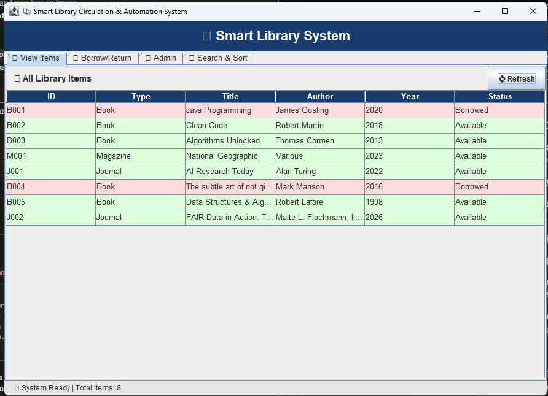
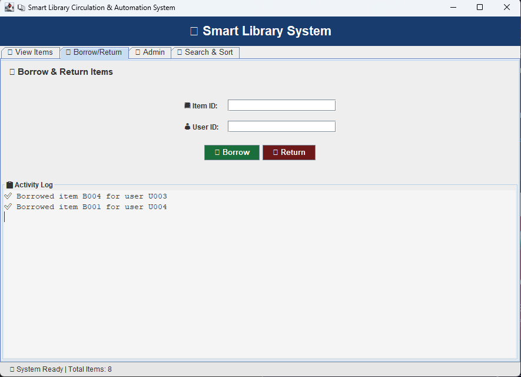
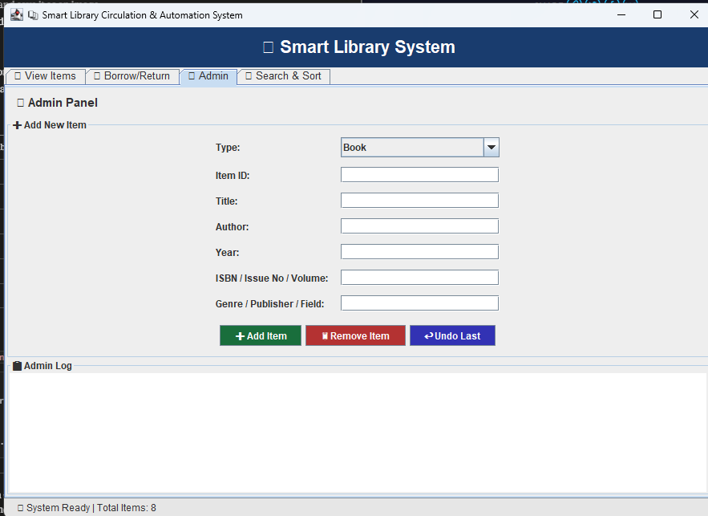
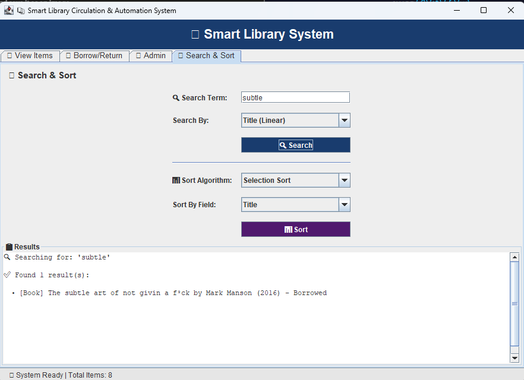

# 📚 Smart Library Circulation & Automation System (SLCAS)

> A fully functional desktop application built in Java for managing a university library — featuring OOP design, data structures, sorting/searching algorithms, and a GUI dashboard.


---

## 📋 Table of Contents

- [About the Project](#about-the-project)
- [Features](#features)
- [Project Structure](#project-structure)
- [Technologies Used](#technologies-used)
- [Data Structures](#data-structures)
- [Algorithms](#algorithms)
- [Getting Started](#getting-started)
- [How to Use](#how-to-use)
- [Screenshots](#screenshots)
- [Author](#author)

---

## 📖 About the Project

The **Smart Library Circulation & Automation System (SLCAS)** is a desktop application developed as part of the COS 202 coursework at MIVA Open University. It digitises and automates the day-to-day operations of a university library.

The system allows library staff to:
- Manage a catalogue of Books, Magazines, and Journals
- Handle borrowing and returning of items
- Maintain a reservation waitlist
- Search and sort the catalogue using multiple algorithms
- Save and load all data between sessions

Built entirely in Java using **Object-Oriented Programming** principles, the project demonstrates real-world use of class hierarchies, interfaces, data structures, and event-driven GUI programming.

---

## ✨ Features

| Feature | Description |
|---|---|
| 📖 **Item Management** | Add, remove, and view Books, Magazines, and Journals |
| 🔄 **Borrow & Return** | Borrow and return items with real-time status updates |
| ⏳ **Reservation Queue** | Automatic waitlist when an item is already borrowed |
| 🔍 **Search** | Linear, Binary, and Recursive search by title, author, or type |
| 📊 **Sort** | Selection Sort, Insertion Sort, Merge Sort, and Quick Sort |
| ↩️ **Undo System** | Undo the last admin action using a Stack |
| 🖥️ **GUI Dashboard** | Multi-tab graphical interface with colour-coded tables |
| 💾 **Data Persistence** | Auto-save and load data from text files |
| ✅ **Input Validation** | Error handling and dialog popups for invalid input |

---

## 🗂️ Project Structure

```
LibrarySystem/
│
├── model/
│   ├── LibraryItem.java        # Abstract base class for all items
│   ├── Borrowable.java         # Interface for borrowable items
│   ├── Book.java               # Extends LibraryItem, implements Borrowable
│   ├── Magazine.java           # Extends LibraryItem
│   ├── Journal.java            # Extends LibraryItem
│   └── UserAccount.java        # Library member with borrow history
│
├── controller/
│   ├── LibraryManager.java     # Core logic — manages items, users, undo
│   ├── SearchEngine.java       # Linear, Binary, and Recursive search
│   └── SortEngine.java         # Selection, Insertion, Merge, Quick sort
│
├── gui/
│   ├── MainWindow.java         # Main application window (JFrame)
│   ├── ViewItemsPanel.java     # Tab: displays all library items in a table
│   ├── BorrowPanel.java        # Tab: borrow and return items
│   ├── AdminPanel.java         # Tab: add/remove items, register users
│   └── SearchSortPanel.java    # Tab: search and sort the catalogue
│
├── utils/
│   ├── FileHandler.java        # Save and load data from .txt files
│   └── IDGenerator.java        # Auto-generates unique IDs
│
├── Main.java                   # Entry point — launches the GUI
├── library_items.txt           # Auto-generated: saved item data
└── library_users.txt           # Auto-generated: saved user data
```

---

## 🛠️ Technologies Used

- **Java 17+** — Core programming language
- **Java Swing** — GUI framework (JFrame, JPanel, JTable, JButton, etc.)
- **Java AWT** — Layout managers (BorderLayout, GridBagLayout, FlowLayout)
- **Java I/O** — File reading and writing (BufferedReader, BufferedWriter)
- **Java Collections** — ArrayList, LinkedList (Queue), Stack

---

## 🗃️ Data Structures

| Structure | Where Used | Purpose |
|---|---|---|
| `ArrayList` | `LibraryManager` | Stores all library items and users dynamically |
| `Queue` (LinkedList) | `LibraryManager` | Reservation waitlist — first in, first served |
| `Stack` | `LibraryManager` | Undo last admin action — last in, first out |
| `Array` (fixed) | `LibraryManager` | Cache for top 5 most frequently accessed items |

---

## 🔍 Algorithms

### Search Algorithms

| Algorithm | How It Works | Best Used When |
|---|---|---|
| **Linear Search** | Checks every item one by one | Unsorted list, partial matches |
| **Binary Search** | Jumps to the middle, goes left or right | Sorted list, exact matches |
| **Recursive Search** | Calls itself until the item is found | Demonstrating recursion |

### Sorting Algorithms

| Algorithm | Strategy | Complexity | Sorts By |
|---|---|---|---|
| **Selection Sort** | Find smallest, move to front | O(n²) | Title |
| **Insertion Sort** | Pick one, slide into correct place | O(n²) | Author |
| **Merge Sort** | Split, sort halves, merge back | O(n log n) | Year |
| **Quick Sort** | Pick pivot, partition, recurse | O(n log n) avg | Title |

---

## 🚀 Getting Started

### Prerequisites

Make sure you have the following installed:

- [Java JDK 17 or higher](https://adoptium.net)
- [VS Code](https://code.visualstudio.com/) with the [Extension Pack for Java](https://marketplace.visualstudio.com/items?itemName=vscjava.vscode-java-pack)

### Check Java Version

```bash
java -version
```

You should see something like `java version "17.0.x"`.

### Clone the Repository

```bash
git clone https://github.com/YOUR_USERNAME/LibrarySystem.git
cd LibrarySystem
```

### Run the Application

**Option 1 — Using VS Code:**
1. Open the `LibrarySystem` folder in VS Code
2. Open `Main.java`
3. Right-click and select **Run Java**

**Option 2 — Using the terminal:**
```bash
# Compile all files
javac -d out model/*.java controller/*.java gui/*.java utils/*.java Main.java

# Run the application
java -cp out Main
```

---

## 🖥️ How to Use

### View Items Tab
- See all library items in a colour-coded table
- Green rows = Available, Red rows = Borrowed
- Click **Refresh** to update the table

### Borrow / Return Tab
- Enter an **Item ID** (e.g. `B001`) and a **User ID** (e.g. `U001`)
- Click **Borrow** to borrow an item
- If the item is already borrowed, you are added to the waitlist automatically
- Click **Return** to return an item

### Admin Tab
- **Add Item** — fill in the form and select Book, Magazine, or Journal
- **Remove Item** — enter an Item ID to remove it
- **Undo Last** — reverses the most recent admin action
- **Register User** — add a new library member
- **Save Data** — manually save all data to file

### Search & Sort Tab
- Type a search term and choose a search method from the dropdown
- Choose a sort algorithm and field, then click **Sort**
- Results appear in the output panel below

### Data is saved automatically when you close the app! 💾

---

## 📸 Screenshots

> *(Add your screenshots here after taking them)*

| View Items Tab | Borrow & Return Tab |
|---|---|
|  |  |

| Admin Panel | Search & Sort Tab |
|---|---|
|  |  |

---

## 👤 Author

**Fuad Oyediran**

- 🎓 Student at MIVA Open University
- 📚 Course: COS 202 — Computer Programming II
- 🌍 Nigeria

---

## 📄 License

This project was developed for academic purposes as part of my course assessment at MIVA Open University.

---

*Built with Java — from a total beginner to a working desktop application! 🚀*
